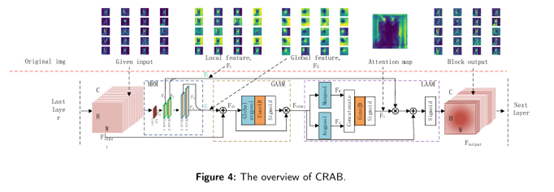
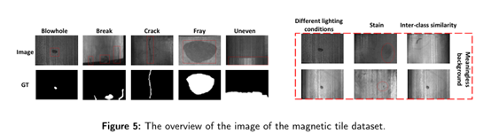

# Attention-Based Convolution Neural Network for Magnetic Tile Surface Defect Classification and Detection 
#(convolutional retinal attention block:CRAB)

Li Ju，Kai Wang, Mengfan He, Luyao Ke, and Heng Wang. Attention-Based Convolution Neural Network for Magnetic Tile Surface Defect Classification and Detection[J]. Applied Soft Computing, 2024: 111631. (https://doi.org/10.1016/j.asoc.2024.111631)

If you find this paper is useful and helpful to your work, please cite our paper in your research work. Thanks.

If there are any questions about source code, please do not hesitate to contact Ju Li(leeju96@qq.com) and me (kai.wang@scu.edu.cn).




## How to use the code
### Running environment:
The proposed methods are implemented in Python 3.7 with PyTorch framework on a desktop computer equipped with an Intel i9 7920X CPU and an NVIDIA RTX 3090 GPU.

### Dataset used in this paper:
1.	[CIFAR-10 & CIFAR-100](http://www.cs.toronto.edu/~kriz/cifar.html)
2.	[CALTECH 101](https://data.caltech.edu/records/mzrjq-6wc02)
3.	[Magnetic tile](https://github.com/Charmve/Surface-Defect-Detection/tree/master/Magnetic-Tile-Defect)
4.  [AMT](https://pan.baidu.com/s/1lofG73Xg4Hz6ytBP30eBmg?pwd=79l7)

### Experimental results:
1.	Surface defect classification based on Resnet-18 and 50 with CIFAR-10 dataset.
2.	Surface defect classification based on Resnet-18 and 50 with CIFAR-100 dataset.
3.	Surface defect detection based on YOLOv4 with AMT dataset.

### Source code: 
1.	Surface defect classification based on Resnet-18 and 50 with AMT dataset.
2.	Surface defect detection based on YOLOv4 with AMT dataset.

### How to reproduce the experimental results of surface defect classification.
1.	find the `cal_101_resnet.py` file in classification folder:
2.	configurable arguments:
    ``` train.py [--link_place LINK_PLACE] [--re_co RE_CO] [--backbone BACKBONE] ```
3.	train your backbone
4.	evaluating results will automatically show after training.

Similarly, How to reproduce the experimental results of surface defect detection.
1.	find the `train.py` file in detection folder:
2.	configurable arguments:
  ``` train.py [--weight_path WEIGHT_PATH] [--resume] [--gpu_id GPU_ID] [--log_path LOG_PATH] [--accumulate ACCUMULATE] [--fp_16 FP_16] ```
3.	train your backbone
4.	evaluating results will automatically show after training.

Tips: The experimental results included in the above "Experimental_Results" files are re-calculated when submitting code, which may be a slight deviation from the results reported in our paper due to the effects of randomness of choosing training samples.

### reference：
1. Y. Huang, C. Qiu, K. Yuan, Surface defect saliency of magnetic tile, The Visual Computer 36 (2020) 85–96.
